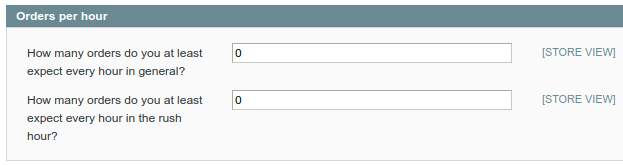

# koality.io Magento1 / OpenMage Plugin
## Description
This plugin can be used to continuously monitor a Magento1 / OpenMage shop for business metrics.

## Layout in koality.io backend


## Metrics

The following metrics are currently implemented:

- **Minimum orders per hour** - this check fails if the number of orders within the last hour falls under a given threshold. The check provides two time intervals. Rush hour and normal shopping time. This is needed to minimize false positives.


- **Maximum number of open carts** - fails if there are to many open carts. This often happens if the payment fails, and the customers can't finish the buying process.


- **Minimum number of active products** - this check fails if there are not enough active products in the should. This will help find import errors.

## How the plugin works

The plugin provides a JSON endpoint for the Magento storefront that is secured via a secret token. The endpoint returns the health status of the shop.

### Example
```json
{
    "status": "fail",
    "output": "Some Magento health metrics failed: ",
    "checks": {
        "carts.open.too_many": {
            "status": "fail",
            "output": "There are too many open carts at the moment.",
            "limit": 30,
            "limitType": "max",
            "observedValue": 60,
            "observedUnit": "carts",
            "metricType": "time_series_numeric"
        },
        "products.active": {
            "status": "pass",
            "output": "There are enough active products in your shop.",
            "limit": 0,
            "limitType": "min",
            "observedValue": 1,
            "observedUnit": "products",
            "metricType": "time_series_numeric"
        },
        "orders.too_few": {
            "status": "fail",
            "output": "There were too few orders within the last hour.",
            "limit": 20,
            "limitType": "min",
            "observedValue": 0,
            "observedUnit": "orders",
            "metricType": "time_series_numeric"
        }
    },
    "info": {
        "creator": "koality.io Magento 1 / OpenMage Plugin",
        "version": "1.0.0",
        "plugin_url": "https://www.koality.io/plugins/magento"
    }
}
```

koality.io can interpret this format and will alert if a check fails.

The API endpoint can be found here after installation:
```
https://myshop.com/koality/health/status/<api_key>
```

The format of the Magento1 health endpoint is implementing this standard (still RFC):
```
https://tools.ietf.org/html/draft-inadarei-api-health-check-05
```
## Requirements
- PHP >= 7.3
- Mage_Catalog
- Mage_Core
- Mage_Sales

## Compatibility
- Magento >= 1.7 and < 2.0
- OpenMage

## Installation Instructions
1. Copy all files from the `src` folder into your document root
2. Clear the cache

## Configuration

To configure the plugin, navigate in your Magento admin panel to System -> Configuration -> Services -> koality.io.
There you find the automatically created API key, which must be inserted in the koality.io backend. It is also possible to create a new key using the button below, if needed.


In the next tab you can define the settings for the orders-per-hour metric.
Define a rush hour, if needed, and set the minimal quantity of orders per hour, you expect.
The metric will fail, as soon as the number of orders falls below this limit.




In the section for open carts you can set the maximal quantity of open carts. The metric fails, as soon as there are more open carts than expected.


In the last tab it is possible to enter a minimal expectation for active products.
If there are less active products, then entered here, the metric will fail in the koality.io backend.


## Uninstallation
1. Remove all extension files from your Magento installation.
2. Clear the cache.

## Support
If you have any issues with this extension, please open a [GitHub issue](https://github.com/customgento/module-koality-m1/issues/new). If you have any issues with koality.io, please contact the koality.io support.

## Licence
[OSL - Open Software Licence 3.0](https://opensource.org/licenses/osl-3.0.php)

## Copyright
© 2021 CustomGento GmbH
